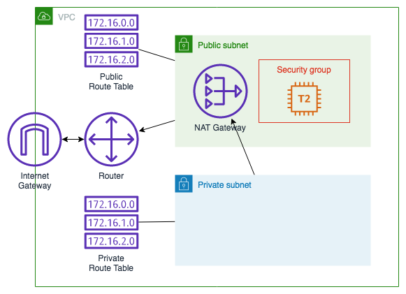

# CloudFormation Lab

The goal is to gain confidence with writing your own templates from scratch.

In this lab you incrementally create a cloudformation template to launch an EC2 instance in a public subnet. You will then make a number of additional improvements to the template, including a private subnet. 



This lab may make a good addition to any of the associate-level courses when they are introducing CloudFormation to students. It is known to work in both AWS Academy Cloud Operations and AWS Academy Cloud Developing sandpits.

## Environment

The recommended environment for running this lab is in a Cloud9 instance in an AWS Academy sandpit lab:

- Start the sandpit lab
- Start a Cloud9 instance
- In the terminal clone this repository with `git clone https://github.com/awslabs/aws-academy-educator-toolkit.git`
- Navigate to aws-academy-educator-toolkit/demos/cloudformation in the file browser
- Navigate to the same location in the terminal with

```bash
cd aws-academy-educator-toolkit/demos/cloudformation
```

- If needed during the lab the solutions for each step are in the solutions directory
- Use the aws cli commands to create and update your stack, only going to the console to track progress or investigate any issues

If you would prefer to use the console and not cli to run cloudformation:

- Create an S3 bucket
- Copy your template to that bucket and use the CloudFormation console to update from that bucket:

```bash
aws s3 cp template.yaml s3://<BUCKET>
```

## Step 1 - Your first template

CloudFormation supports both JSON and YAML formats for templates, but it is much easier for humans to read and write YAML. You can find lots of tutorials on how to write YAML on the internet, the trick is indentation is critical, much like writing Python code.

CloudFormation templates start with

- a format version
- optional description
- at least one resource
- comments start with a `#`

An obvious choice for the first resource to create is a VPC since we can't create any other networking resources without one. CloudFormation documentation describes how to define every resource type CloudFormation supports, the VPC documentation is located at <https://docs.aws.amazon.com/AWSCloudFormation/latest/UserGuide/aws-resource-ec2-vpc.html>.

From the documentation we can determine that:

- For the VPC we need to specify the type `AWS::EC2::VPC`.
- It has a number of parameters. If we look at the parameter descriptions, only the `CidrBlock` is mandatory.

***Create a file*** called `template.yaml` in cloud9 and copy and paste this text, making sure you remember to save (CTRL-S or Command-S):

```yaml
---
AWSTemplateFormatVersion: "2010-09-09"

# Step 1 - Create VPC

Description: Writing your first cloudformation template

# Metadata:

# Parameters:

# Mappings:

# Conditions:

# Transform:

Resources:

# VPC

  VPC:
    Type: AWS::EC2::VPC
    Properties:
      CidrBlock: 10.1.0.0/16

# Outputs:
```

With this definition we are:

- Naming our VPC within the template simply as `VPC`
- We are defining the CIDR block as `10.1.0.0/16`
- The VPC is indented from the `Resources:` label, the Type and Properties are indented from the name of the VPC, and the property `CidrBlock` is indented further than `Properties:`.
- In this template we are not defining parameters or outputs, so we leave those as comments.

Make sure your terminal is in the same directory as where you created your template file:

```bash
ls -l template.yaml
```

***Create the CloudFormation*** stack called `cfn-demo` with

```bash
aws cloudformation create-stack \
    --stack-name cfn-demo \
    --template-body file://template.yaml
```

_Q: How did cloudformation know which region to put the VPC?_

## Step 2 - Adding tags, the ref intrinsic function and updating a stack

Open the VPC console in another tab and look at the VPC you just created. You can see it is missing a name. By tagging resources properly it helps us understand what they are for, who owns them, etc. We can also automatic tasks based on a resource's tag.

Go back to the VPC documentation and you can see it describes how to add tags. The tags parameter takes a list of key/value pairs, and a list element begins with a `-` in YAML:

```yaml
      Tags:
        - Key: KeyName1
          Value: Value1
        - Key: KeyName2
          Value: Value2
```

A good way to name things generated by CloudFormation is to use the name of the template as stack names need to be unique within your account and region. CloudFormation templates support parameters that users can pass in and there are a number of psuedo parameters that CloudFormation also provides. These are described at <https://docs.aws.amazon.com/AWSCloudFormation/latest/UserGuide/pseudo-parameter-reference.html>.

The stack name `"AWS::StackName"` is a psuedo parameter that we can always access in our stack. To refer to a parameter iwe are will use the `!Ref` intrinsic function like this:

```yaml
!Ref "AWS::StackName"
```

Learn more about intrinsic functions here: <https://docs.aws.amazon.com/AWSCloudFormation/latest/UserGuide/intrinsic-function-reference-ref.html>

***Update your template*** to this:

```yaml
---
AWSTemplateFormatVersion: "2010-09-09"

# Step 2 - Add VPC Name

Description: Writing your first cloudformation template

# Metadata:

# Parameters:

# Mappings:

# Conditions:

# Transform:

Resources:

# VPC

  VPC:
    Type: AWS::EC2::VPC
    Properties:
      CidrBlock: 10.1.0.0/16
      Tags:
        - Key: Name
          Value: !Ref "AWS::StackName"

# Outputs:
```

_Q: If we update the stack with a new tag, what will happen to the existing VPC?_

***Update your stack*** with the new template:

```bash
aws cloudformation update-stack \
    --stack-name cfn-demo \
    --template-body file://template.yaml
```

Confirm the VPC name has been updated in the console. Note this name is the name visible in the console for users, the template name of this resource is `VPC` and we will refer to it by that name later in the lab.

## Step 3 - Add parameters and parameter validation

If we plan to reuse this template whenever we want to create a network, we will need to be able to configure some resource settings differently for each network. To do this we use parameters.

***Replace the parameter section*** in your template with a parameter called `VpcCidr` to prompt for the VPC CIDR block, and set the default to `10.1.0.0/16`:


```yaml
Parameters:

  VpcCidr:
    Type: String
    Default: 10.0.0.0/16
```

***Update the VPC resource*** to Use `!Ref` to refer to your parameter in the VPC resource:

```yaml
  VPC:
    Type: AWS::EC2::VPC
    Properties:
      CidrBlock: !Ref VpcCidr
      Tags:
        - Key: Name
          Value: !Ref "AWS::StackName"
```

***Update the stack*** with your new template by running this in the terminal:

```bash
aws cloudformation update-stack \
    --stack-name cfn-demo \
    --template-body file://template.yaml
```

and you should see that your template has been replaced (as it has a new VPC ID) by a new VPC with the `10.0.0.0/16` CIDR block, as that was the default value. If you look in the CloudFormation console events for this template you will see it created the new VPC and then deleted the old one.

You can read more about parameters here: <https://docs.aws.amazon.com/AWSCloudFormation/latest/UserGuide/parameters-section-structure.html>. This document describes how we can perform input validation. 

For example, lets try to create a VPC with a bogus CIDR range. ***Update your stack*** with:

```bash
aws cloudformation update-stack \
    --stack-name cfn-demo \
    --parameters ParameterKey=VpcCidr,ParameterValue=10.300.0.0/16 \
    --template-body file://template.yaml
```

The command runs but if you look in the CloudFormation console you can see it has failed and will be rolling back the change. ***Add some input validation*** to the parameter in your template:

```yaml
    AllowedPattern: ^(([0-9]|[1-9][0-9]|1[0-9]{2}|2[0-4][0-9]|25[0-5])\.){3}([0-9]|[1-9][0-9]|1[0-9]{2}|2[0-4][0-9]|25[0-5])(\/(1[6-9]|2[0-8]))$
```

and ***update the stack*** again with:

```bash
aws cloudformation update-stack \
    --stack-name cfn-demo \
    --parameters ParameterKey=VpcCidr,ParameterValue=10.300.0.0/16 \
    --template-body file://template.yaml
```

This time you get an immediate error from CloudFormation.

[Solution: solutions/03-template.yaml](./solutions/03-template.yaml)

## Step 4 - Refering to other template resources

Lets start building other resources in our VPC, starting with the internet gateway.

First have a quick look at the CloudFormation documentation for an Internet Gateway: <https://docs.aws.amazon.com/AWSCloudFormation/latest/UserGuide/aws-resource-ec2-internetgateway.html>

Scroll down to the YAML example at the end of the document and based on this ***add an internet gateway*** to your template. Use the tags to give it a name.

***Update your stack*** with:

```bash
aws cloudformation update-stack \
    --stack-name cfn-demo \
    --template-body file://template.yaml
```

Have a look at your internet gateway in the console and you will see its state is detached. We still need to attach it to the VPC, which requires another resource. See <https://docs.aws.amazon.com/AWSCloudFormation/latest/UserGuide/aws-resource-ec2-vpc-gateway-attachment.html> for examples.

The `AWS::EC2::VPCGatewayAttachment` can be used for attaching both Internet and VPN gateways, so in our situation we only need to specify the `InternetGatewayId` and `VpcId` properties. To do this use the `!Ref` intrinsic function again, but this time refer to the resource names of the VPC and InternetGateway used in your template:

```yaml
  GatewayAttachment:
    Type: AWS::EC2::VPCGatewayAttachment
    Properties:
      InternetGatewayId: !Ref InternetGateway
      VpcId: !Ref VPC
```

***Update your stack*** with this change using the update-stack cli command.

[Solution: solutions/04-template.yaml](./solutions/04-template.yaml)

_Q: Why keep updating the stack with each change to the template?_

## Step 5 - Sub intrinsic function and waiting for updates to complete

The next thing to build for our network is a public route table and route to the internet. The route table docs are here: <https://docs.aws.amazon.com/AWSCloudFormation/latest/UserGuide/aws-resource-ec2-route-table.html>.

We will eventually create both a public and private route table, so when naming our toute tables we should include public or private in its name. One way to do this is to use the `!Sub` intrinsic function to substitute parameters into a string:

```yaml
  !Sub "${AWS::StackName}-public"
```

***Add a public route table*** to your template.

***Update your stack*** with these two commands:

```bash
aws cloudformation update-stack \
    --stack-name cfn-demo \
    --template-body file://template.yaml

aws cloudformation wait stack-update-complete \
    --stack-name cfn-demo
```

You will have noticed by now that your `update-stack` command completes before the stack has finished updating. If you want to know when the stack has finished, use a `wait` command that polls to see when it is finished.

Now the public route table has been created, we need to add a route to the internet. A route is another resource type documented here: <https://docs.aws.amazon.com/AWSCloudFormation/latest/UserGuide/aws-resource-ec2-route.html>. There are lots of different targets for a route, but we only need three properties

- Reference the route table we just created
- Reference the Internget Gateway as the target for this rule
- The destination CIDR block of `0.0.0.0/0`

***Update your stack*** once again to add the public route and confirm the change in the console.

[Solution: solutions/05-template.yaml](./solutions/05-template.yaml)

## Step 6 - More intrinsic functions

Now we have a public route table we can create a public subnet using the documentation here: <https://docs.aws.amazon.com/AWSCloudFormation/latest/UserGuide/aws-resource-ec2-subnet.html>.

To ensure our subnets are located in different availability zones we will need to be specific in our resource definitions. So far the template does not specify a region and could be deployed to any region, ideally we should keep it region agnostic when we specify availability zones for subnets.

It is possible to create our own mapping table, which we will do in Step 11, but that is something we would have to maintain whenever AWS adds another availability zone or region.

CloudFormation provides some additional intrinsic functions for this problem, the `!GetAZs` function lists the availability zones in this region, and the `!Select` function to extract an item from a list. This will return the first availability zone in our current region:

```yaml
      AvailabilityZone: !Select [ 0, !GetAZs ]
```

For more details on these two intrinsic functions see:

- <https://docs.aws.amazon.com/AWSCloudFormation/latest/UserGuide/intrinsic-function-reference-getavailabilityzones.html>
- <https://docs.aws.amazon.com/AWSCloudFormation/latest/UserGuide/intrinsic-function-reference-select.html>

But wait, there's more; we also need to specify the CIDR block for the VPC. Since we made the CIDR range for the VPC a parameter we can't hardcode the subnet CIDR block. The simplest approach might be to add another parameter for the public subnet CIDR, but we can use another intrinsic function to calculate the CIDR range for us.

The `!GetAtt` function will return a different attribute from a resource, see the Return Values section in the documentation for a list of other attributes. In this case we get the CIDR block for the VPC. The `!Cidr` function can return CIDR ranges within a block, in this case 20 x /24 ranges, and then we can use `!Select` to pick a range:

```yaml
      CidrBlock: !Select [ 0, !Cidr [ !GetAtt VPC.CidrBlock, 20, 8 ]]
```

For our next subnet we might use this CIDR range, picking the next range in the list:

```yaml
      CidrBlock: !Select [ 1, !Cidr [ !GetAtt VPC.CidrBlock, 20, 8 ]]
```

See this document for more information about `!Cidr`: <https://docs.aws.amazon.com/AWSCloudFormation/latest/UserGuide/intrinsic-function-reference-cidr.html>

An alternative to `!Sub` for building strings is to use the `!Join` function, for example you could use this to generate the names for your subnets: 

```yaml
      Tags:
        - Key: Name
          Value: !Join ['-', ["public", !Ref "AWS::StackName", !Select [ 0, !GetAZs ]]]
```

See this document for more information about the `!Join` intrinsic function:
<https://docs.aws.amazon.com/AWSCloudFormation/latest/UserGuide/intrinsic-function-reference-join.html>

Because this is a public subnet, add the `MapPublicIpOnLaunch` property so EC2 instances are automatically allocated a public IP address.

***Update your stack*** and check your net subnet in the console.

[Solution: solutions/06-template.yaml](./solutions/06-template.yaml)

## Step 7 - Subnet and Route Table Association

Q: What route table is your subnet associated with? A: The default route table, not your public route table.

Associate the public route table we created with the public subnet using this resource: <https://docs.aws.amazon.com/AWSCloudFormation/latest/UserGuide/aws-resource-ec2-subnet-route-table-assoc.html>

***Update your stack***.

_Q: Could we have created the public subnet prior to the public route table?_

[Solution: solutions/07-template.yaml](./solutions/07-template.yaml)

## Step 8 - Security Group

Before we can create an instance in our subnet, we will need a security group with at least port 80 open so we can connect to it. A security group resource is described here <https://docs.aws.amazon.com/AWSCloudFormation/latest/UserGuide/aws-properties-ec2-security-group.html>

Strangely, the SecurityGroup resource type in cloudformation includes properties for its name and description. You can also tag the security group as well. The ingress and egress rules can be embedded in the security group definition, but it is easier to read to you use resources for each rule, as described here: <https://docs.aws.amazon.com/AWSCloudFormation/latest/UserGuide/aws-properties-ec2-security-group-ingress.html>

***Create a security group*** for your web server and ***update the stack***.

***Add an ingress rule*** for port 80 from the internet to the security group, including a description of what this rule is for.

[Solution: solutions/08-template.yaml](./solutions/08-template.yaml)

## Step 9

Have a look at the documentation for creating an EC2 instance: <https://docs.aws.amazon.com/AWSCloudFormation/latest/UserGuide/aws-properties-ec2-instance.html>

There are a lot more properties here, but most are optional. The properties we need to worry about are:

- InstanceType
- KeyName
- SecurityGroupIds
- SubnetId
- UserData
- Tags

`SubnetId` and `Tags` should be straightforward. `SecurityGroupIds` is a little more complicated since it is expecting a list even though we only have one:

```yaml
      SecurityGroupIds:
        - !Ref WebSecurityGroup
```

For the `InstanceType` we can hard code `t2.micro` for now.

It would be best if the AMI and Access Key were not hardcoded but specified as parameters as these will vary by region. With the VPC CIDR we used a string, but for the AMI and Access key we can use different parameter types that help pre-fill the values: <https://docs.aws.amazon.com/AWSCloudFormation/latest/UserGuide/parameters-section-structure.html#aws-specific-parameter-types>

For the image ID we want to fetch the latest AMI ID for a particular image, in this case Amazon Linux 2, so specify this `/aws/service/ami-amazon-linux-latest/amzn2-ami-hvm-x86_64-gp2` path as the default. Also ask for the key pair as a parameter of type `AWS::EC2::KeyPair::KeyName` and specify a default key if known:

```yaml
  AMI:
    Type: AWS::SSM::Parameter::Value<AWS::EC2::Image::Id>
    Default: /aws/service/ami-amazon-linux-latest/amzn2-ami-hvm-x86_64-gp2
    Description: Parameter store path to AMI ID

  KeyName:
    Type: AWS::EC2::KeyPair::KeyName
    Default: vockey # Default key in Vocareum
```

Last but not least is the user data. You can provide a script using the follow syntax, in this case to install and run a web server. Note that the userdata needs to be Base64 encoded using another intrinsic function:

```yaml
      UserData:
        Fn::Base64: !Sub |
          #!/bin/bash
          # Install Apache Web Server
          yum install -y httpd
          # Add a message to the web server
          echo "What are you doing Dave?" > /var/www/html/index.html
          # Turn on web server
          systemctl start httpd
          systemctl enable httpd
```

***Add your web server resource*** to your stack.
***Update your stack*** and specify your keyname if needed:

```bash
aws cloudformation update-stack \
    --stack-name cfn-demo \
    --template-body file://template.yaml \
    --parameters ParameterKey=KeyName,ParameterValue=mykey
```

***Watch the progress*** of your update:

```bash
watch -n 5 -d \
    aws cloudformation describe-stack-resources \
    --stack-name cfn-demo \
    --query 'StackResources[*].[LogicalResourceId,ResourceType,ResourceStatus]' \
    --output table
```

This will update a table showing the state of the resources in the stack. Press `ctrl-c` when all resources have been created or updated.

_Q: The cloudformation template completes before the instance has finished starting. What if the next resource we create depends on the instance running?_

[Solution: solutions/09-template.yaml](./solutions/09-template.yaml)

## Step 10

At this point in the lab we often instruct students to look in the Vocareum lab details for the IP address of the instance, or look in the console. For resource attributes the template can explicitly output values that we need from the resources in the stack.

- <https://docs.aws.amazon.com/AWSCloudFormation/latest/UserGuide/outputs-section-structure.html>

Output the instance IP address. For bonus points also output the URL for the web server running on the instance.

[Solution](./solutions/10-template.yaml)

```bash
$ aws cloudformation describe-stacks \
    --stack cfn-demo \
    --query 'Stacks[*].Outputs[*]' \
    --output table

---------------------------------------------------------------------
|                          DescribeStacks                           |
+-----------------------------+------------+------------------------+
|         Description         | OutputKey  |      OutputValue       |
+-----------------------------+------------+------------------------+
|  Instance Public IP Address |  PublicIP  |  34.205.28.192         |
|  Instance Web Site          |  WebSite   |  http://34.205.28.192  |
+-----------------------------+------------+------------------------+
```

## Step 11

In Step 9 the instane type was hardcoded, but if we wanted to use different instance sizes depending on a parameter we can specify? A common way to do this is to add a map.

- <https://docs.aws.amazon.com/AWSCloudFormation/latest/UserGuide/mappings-section-structure.html>

A map allows us to hardcode a set of values but select the appropriate value based on the region we are in or a parameter the user sets.

- Add a parameter that allows the user to select from `Micro`, `Small` and `Large`, with `Micro` as the default
- Add a mapping for those values to different instance sizes

```yaml
Mappings:

  InstanceDetails:
    Micro:
      Type: t2.micro
    Small:
      Type: t3.small
    Large:
      Type: m5.large
```

Now instead of hard coding t2.micro, use `!FindinMap` to look up the type of instance based on the size parameter.

[Solution](./solutions/11-template.yaml)

If you get an error that there is nothing to update that means your change has worked, the map lookup resulted in the same size as the running instance, a `t2.micro`.

## Step 12

We have web access to the instance, but what about SSH? An access key was installed but we never added SSH to the security group. How can we specify the CIDR range that we want to permit for the SSH client, ideally this should not `0.0.0.0/0`, and how can we make SSH access optional?

- Create a new parameter that takes the permitted CIDR range.

```yaml
  SSHCidr:
    Type: String
    Default: ""
    Description: Leave empty for no SSH access, otherwise specify trusted CIDR
```

- Create a condition so that if the CIDR range is empty, do not add SSH access to the instance
  - <https://docs.aws.amazon.com/AWSCloudFormation/latest/UserGuide/conditions-section-structure.html>

[Solution](./solutions/12-template.yaml)

Update your template passing in your external IPv4 address and confirm you can ssh to the instance.

```bash
aws cloudformation update-stack \
    --stack-name cfn-demo \
    --template-body file://template.yaml \
    --parameters ParameterKey=KeyName,ParameterValue=vockey ParameterKey=SSHCidr,ParameterValue=<IP Address>
```

## Step 13

There are now 5 parameters users can specify. As the list of parameters grow they can be harder for the user to understand. You can provide a `Description` with the parameters, but you can provide additional meta data to customer the layout of the parameters.

- <https://docs.aws.amazon.com/AWSCloudFormation/latest/UserGuide/aws-resource-cloudformation-interface.html>

Create two `ParameterGroups` and `ParameterLabels` for the parameters in your template.

[Solution](./solutions/13-template.yaml)

Because this step creates no new resources, complete the next step before testing these changes.

# Step 14

We create a simple VPC with just one public subnet, what about a private subnet? First think about the components you will need and what order you need to create these resources:

- Private Route Table
- Private Route
- Private Subnet
- NAT Gateway
- Elastic IP for the NAT Gateway

The order of resources in the template does not influence the order in which they are created. CloudFormation builds a dependency graph and determines the order resources can be created based on how the resources reference each other. This allows it to create multiple resources in parallel if they do no depend on each other.

In defining these resources you will find you will need more resources, and you will also need to tell CloudFormation about a dependency because a resource (NAT Gateway) depends on the Internet Gateway being attached to the VPC, but there is no reference to the Internet Gateway Attachment in its properties. You will not encounter this race because your Internet Gateway is already in place, but if you were running this template from scratch, you would risk a random error on some runs.

- <https://docs.aws.amazon.com/AWSCloudFormation/latest/UserGuide/aws-attribute-dependson.html>

For the private subnet, use `!Cidr` again but this time select a different range.

[Solution](./solutions/14-template.yaml)

## Step 15

It is scarily easy to destroy all the resources you just built, but **before you run this** how can we protect important resources from deletion?

```bash
# Don't do this just yet
aws cloudformation delete-stack --stack-name cfn-demo
```

Lets add an EBS volume to the instance, but configure the volume to create a snapshot when the template deletes.

- <https://docs.aws.amazon.com/AWSCloudFormation/latest/UserGuide/aws-attribute-deletionpolicy.html>
- <https://docs.aws.amazon.com/AWSCloudFormation/latest/UserGuide/aws-properties-ec2-ebs-volume.html>

For the size of the volume, extend the map so that different size instances get a different size volume attached. Can you attach the volume without rebuilding the instance?

[Solution](./solutions/15-template.yaml)

Update your stack to add the volume to your instance.

See <https://docs.aws.amazon.com/AWSCloudFormation/latest/UserGuide/protect-stack-resources.html> for other ways you can protect resources from accidental deletion.

## Step 16

In the console open up CloudFormation designer and view your template graphically.

Note: At time of writing, the design does not support !Cidr so you may need to replace the two times this function is used and hardcode CIDR ranges for the subnets to get the designer to work.

## Additional Steps

If you want to keep going, you can try...

- Use the help scripts to wait for the EC2 instance to finish startup
  - <https://docs.aws.amazon.com/AWSCloudFormation/latest/UserGuide/cfn-helper-scripts-reference.html>
- Create public and private subnets across 2 or more availability zones
- Split the template in a Master, Network and Application templates.
  - <https://docs.aws.amazon.com/AWSCloudFormation/latest/UserGuide/best-practices.html#nested>
- Use exports to reference values across stacks
- Create an application load balancer, target group, autoscaling group and launch config to run multiple web servers
- Use stacksets to deploy to multiple regions

## Cleanup

```bash
aws cloudformation delete-stack --stack-name cfn-demo
```

Navigate to EC2->Snapshots and confirm a snapshot was generated for the volume.

## License Summary

This sample code is made available under the MIT-0 license. See the LICENSE file.